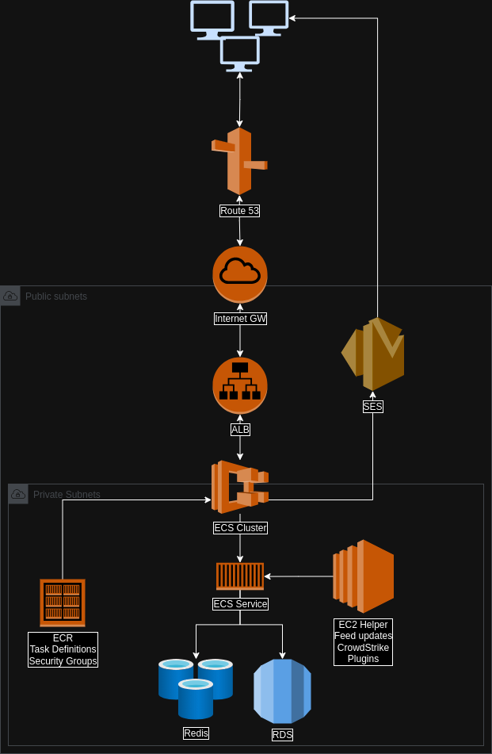

# Terraform MISP
Terraform stack for the MISP infrastructure.

## What is MISP
MISP, formerly Malware Information Sharing Platform and now known as the Open Source Threat Sharing Platform, is a powerful open source threat intelligence platform organisations can use to store, share and receive information about malware, threats, and vulnerabilities in a structured way.

## MISP on the Docker
MISP container (Docker) image focused on high performance and security based on AlmaLinux, ready for production.

This image contains the latest version of MISP and the required dependencies. Image is intended as immutable, which means that it is not possible to update MISP from the user interface and instead, an admin should download a newer image.

## Environmental variables
- MYSQL_HOST (required, string) - hostname or IP address
- MYSQL_PORT (optional, int, default 3306)
- MYSQL_LOGIN (required, string) - database user
- MYSQL_PASSWORD (optional, string)
- MYSQL_DATABASE (required, string) - database name
- REDIS_HOST (required, string) - hostname or IP address
- REDIS_PASSWORD (optional, string) - password used to connect password-protected Redis instance
- REDIS_USE_TLS (optional, bool) - enable encrypted communication
- MISP_BASEURL (required, string) - full URL with https:// or http://
- MISP_UUID (required, string) - MISP instance UUID (can be generated by uuidgen command)
- MISP_ORG (required, string) - MISP default organisation name
- MISP_HOST_ORG_ID (optional, int, default 1) - MISP default organisation ID
- MISP_MODULE_URL (optional, string) - full URL to MISP modules
- MISP_DEBUG (optional, boolean, default false) - enable debug mode (do not enable on production environment)
- MISP_OUTPUT_COMPRESSION (optional, boolean, default true) - enable or disable gzip or brotli output compression
- SMTP_HOST (optional, string) - SMTP server that will be used for sending emails. SMTP server must support STARTTLS.
- SMTP_PORT (optional, int, default 25) - the TCP port for the SMTP host. Must support STARTTLS.
- SMTP_USERNAME (optional, string)
- SMTP_PASSWORD (optional, string)
- MISP_EMAIL (required, string) - the email address that MISP should use for all notifications

There is more optional variables available - described on developers [site](https://github.com/NUKIB/misp)

# Schema

## AWS Setup
AWS Setup is based on private and public VPCs handling frontend and backend setup.
- Github Actions is used for deployments, maintenance (image updates, task definition updates)
- When quering [misp url](misp.cyber-security.digital.cabinet-office.gov.uk) you are facing Internet Gateways allowing traffic to the LoadBalancers and ECS Service
- Route53 is forwarding traffic to the Load Balancer
- Load Balancer is routing traffic to the ECS Service (MISP)
- MISP service is being managed by task definitions. These contains all important variables. It also pulls secrets from Secret Manager - for databe connectivity, SALT SHAs and other sensitive information
- MISP containers are being checked before updated into our ECR registry. Once new revision added Task Definition is being updated and ECS Service is updating to the latest stable and approved version
- ECS Service is connecting to the Redis which caches some requests and stores copy of feeds locally. These are being updated every hour
- ECS Service is also connecting to the database, storing feeds, further configuration, user base, etc
- ECS is connecting to the AWS SES which is sending emails when required

## todo:
- Some of the values in TF seems to be hardcoded
- terraform import worked fine and terraform apply didn't break anything on the working infrastructure, but there are some bits which doesn't work properly at the moment on the fresh deployment
    - EC2 instance is missing after installation process, Ansible or EC2 scripts recommended to install plugins, set cron and crowdstrike updates
    - EC2 instance doesn't properly handle security groups
    - some of the IAM policies are missing (ECS task for example)
    - Some of the AWS secrets when value null can be created with terrafrom - passwords for example. There are not at the moment
    - Load Balancer target groups are maintained manually - missed when doing imports
    - Route53 subdomain is done manaully but can be done automatically as well
    - Certifications aren't handled with TF as they belong to the Route53 separately
    - AWS SES - email configuration isn't fully automated yet
- Terraform also doesn't setup DB backups yet
- ECS container is missing volumes at the moment. There is a benefit of attaching some - especially `/var/www/MISP/app/attachments/` which gives possiblities to upload malware samples and attachments

